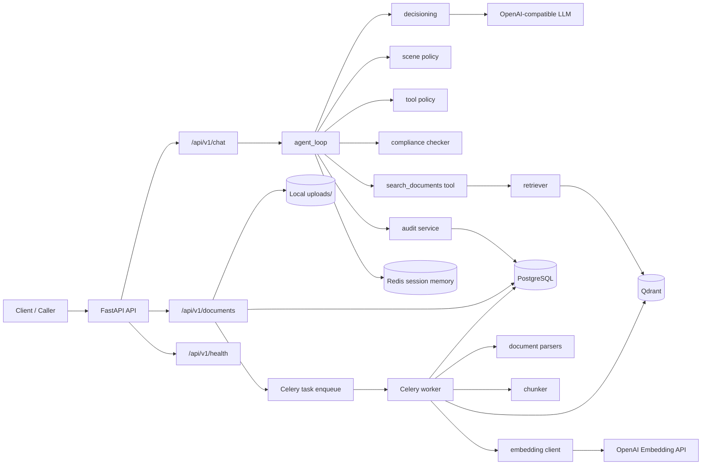

# 项目面试复习文档

> 说明
>
> - 本文档严格基于当前工作区代码分析生成。
> - 当前项目**未发现 README**，主要依据 `pyproject.toml`、`docker/docker-compose.yml`、`app/`、`tests/`、`dev-log.md`、Alembic migration 等文件推断。
> - 当前项目**未发现前端代码**，整体是一个以后端为核心的 AI Agent / RAG 服务。
> - 如果一次输出过长，本文先覆盖第 1-8 部分，后续可继续补 9-18 部分。

## 目录

1. 项目一句话介绍
2. 项目背景与解决的问题
3. 项目整体架构
4. 项目是如何搭建和启动的
5. 核心业务流程
6. 核心代码模块解析
7. 数据库与数据模型设计
8. API 接口梳理

---

## 1. 项目一句话介绍

这个项目是一个面向证券研究 / 投研场景的后端 AI Agent 平台，支持文档上传、异步解析、向量化检索、结构化决策、场景级策略控制和合规阻断。技术上以 `FastAPI + PostgreSQL + Redis + Qdrant + Celery + OpenAI-compatible LLM` 为核心，重点不只是做 RAG 问答，而是把“受控 Agent”所需的决策、权限边界和审计链路搭起来。  

如果在面试开头介绍，我建议这样说：

“我做了一个后端型智能投研助手，核心是把上传的研报、公告和财报做异步解析与向量化，然后通过 Agent 决策层、策略层和合规层来控制检索与回答流程。这个项目的亮点不是普通 RAG，而是我把结构化决策、policy、audit 和只读受控执行链路做进去了，更接近一个可控的金融研究 Agent。”

---

## 2. 项目背景与解决的问题

### 2.1 面向什么场景

从代码和 prompt 看，项目面向的是**证券研究 / 投研问答 / 文档分析**场景，而不是通用聊天机器人。  
代码依据：

- `app/agent/llm_client.py` 中的 `SYSTEM_PROMPT`
- `app/api/v1/documents.py` 提供文档上传与处理接口
- `app/agent/retriever.py` / `app/agent/tools.py` 提供文档级检索能力

### 2.2 目标用户是谁

根据现有代码推断，目标用户更可能是：

- 研究员 / 投研实习生
- 需要快速阅读财报、公告、研报的人
- 内部使用的研究辅助系统调用方

代码中**未发现**明确的多角色业务对象定义，也**未发现**面向终端投资者的完整产品流程；更像一个“内部研究助手后端”。

### 2.3 解决了什么问题

这个项目试图解决 4 类问题：

1. **文档知识无法直接被 LLM 消化**
   - 通过上传文档、解析、切块、embedding、Qdrant 检索，把外部研报和公告接入模型上下文。

2. **普通 RAG 不能很好地处理投研工作流**
   - 不只是“问答”，而是加入了结构化决策 `AgentDecision`、场景级 policy、工具级 policy、合规阻断和审计。

3. **长对话容易丢上下文**
   - 使用 Redis 会话存储和摘要压缩，避免上下文无限增长。

4. **金融 / 研究场景需要更强控制**
   - 项目显式加入了：
     - 请求身份上下文
     - 文档归属隔离
     - 工具调用策略层
     - 输出合规检查
     - 审计事件链路

### 2.4 为什么这个项目有实际意义

它的实际意义在于：它展示的不是“怎么把大模型接起来”，而是“怎么把大模型放进一个受控研究系统里”。  

很多 RAG Demo 只能做到：

```text
用户提问 -> 检索 -> 大模型回答
```

但这个项目逐步演进成：

```text
用户提问
-> 结构化决策
-> 场景级 policy
-> 工具级 policy
-> 只读检索
-> 最终回答
-> 合规阻断
-> 审计留痕
```

这在面试里是非常有价值的，因为它说明你理解了：

- AI 应用不仅是“模型接 API”
- 真正的业务系统需要控制面、状态流和工程约束

### 2.5 “为什么做这个项目”面试回答建议

建议你这样回答：

“我想做的不是一个普通的 RAG Demo，而是一个更接近真实业务系统的投研 Agent。因为在研究场景里，问题不只是‘模型能不能答’，还包括文档怎么处理、检索怎么控、回答怎么约束、出现风险怎么阻断、过程怎么审计。所以我把文档处理、Agent 决策、policy、compliance 和 audit 都串起来，做成一个后端型的研究 Agent 平台。”

---

## 3. 项目整体架构

### 3.1 架构文字说明

当前项目是一个**后端为中心的 AI Agent 系统**，没有发现前端代码。整体由以下几部分组成：

1. **HTTP API 层**
   - 使用 `FastAPI`
   - 提供健康检查、文档上传管理、聊天问答、会话管理接口

2. **Agent / Decision / Policy 层**
   - `agent_loop` 负责核心对话链路
   - `decisioning` 先让模型输出结构化决策对象
   - `policy` 分为：
     - 场景级 policy：决定当前请求是否允许自动处理
     - 工具级 policy：决定工具是否能调、参数是否合规

3. **RAG / 文档处理层**
   - 上传文件进入异步文档处理 pipeline
   - 解析 PDF/Excel/HTML/TXT
   - 切块
   - 调 embedding
   - 存入 Qdrant
   - 聊天时再按用户归属过滤检索

4. **存储层**
   - `PostgreSQL`：文档元数据、审计事件
   - `Redis`：会话历史与摘要
   - `Qdrant`：文档向量
   - 本地 `uploads/`：原始文件落盘

5. **异步执行层**
   - `Celery` + `Redis` broker/backend
   - 处理文档解析与向量化任务

6. **模型层**
   - 聊天模型：OpenAI-compatible provider，默认是 `Deepseek`
   - Embedding：`OpenAI text-embedding-3-small`

### 3.2 Mermaid 架构图



### 3.3 每个模块职责说明

#### API 层

- `app/api/v1/chat.py`
  - 聊天接口
  - SSE 流式返回
  - 会话查询与清理

- `app/api/v1/documents.py`
  - 文件上传
  - 文档列表 / 详情 / 删除
  - 将上传任务投递给 Celery

- `app/api/v1/health.py`
  - 检查 PostgreSQL / Redis / Qdrant 连通性

#### Agent / 决策 / 策略层

- `app/agent/agent_loop.py`
  - 核心流程编排器
  - 串联 memory、decision、policy、tool、compliance、audit

- `app/agent/decisioning.py`
  - 生成结构化 `AgentDecision`
  - 根据 tool result 生成最终答复

- `app/policy/service.py`
  - `evaluate_agent_decision`：场景级决策审批
  - `evaluate_tool_call`：工具级参数与权限审批

#### RAG 层

- `app/agent/retriever.py`
  - embedding query
  - Qdrant 查询
  - 按 `tenant_id + owner_user_id` 过滤

- `app/agent/tools.py`
  - 当前只有 `search_documents`
  - 负责 tool dispatch 和结果格式化

#### 文档处理层

- `app/tasks/doc_tasks.py`
  - Celery worker 入口
  - 解析、切块、embedding、Qdrant 存储、DB 状态更新

- `app/doc_pipeline/parsers/`
  - 支持 `pdf / xlsx / xls / html / htm / txt`

- `app/doc_pipeline/chunker.py`
  - 按 token / fallback 字符切分

- `app/doc_pipeline/embedder.py`
  - 批量 embedding 调用

#### 存储层

- `PostgreSQL`
  - 文档元数据
  - 审计事件

- `Redis`
  - 对话历史
  - 历史摘要

- `Qdrant`
  - 文档 chunk 向量

#### 外部服务

- `Deepseek`（通过 OpenAI-compatible API）
- `OpenAI Embedding API`
- `Docker` 中启动 PostgreSQL / Redis / Qdrant

---

## 4. 项目是如何搭建和启动的

> 说明：以下内容大部分来自代码和配置推断，因为项目中**未发现正式 README**。

### 4.1 本地开发环境需要安装什么

根据 `pyproject.toml` 和 Docker 配置，建议准备：

- Python 3.11+
- Docker / Docker Compose
- PostgreSQL（如果不用 Docker）
- Redis（如果不用 Docker）
- Qdrant（如果不用 Docker）

### 4.2 环境变量需要配置什么

依据 `.env.example`：

- App
  - `APP_ENV`
  - `APP_DEBUG`
  - `APP_SECRET_KEY`

- LLM
  - `LLM_API_KEY`
  - `LLM_BASE_URL`
  - `LLM_MODEL`
  - `LLM_MAX_TOKENS`

- Embedding
  - `OPENAI_API_KEY`
  - `EMBEDDING_MODEL`

- PostgreSQL
  - `POSTGRES_HOST`
  - `POSTGRES_PORT`
  - `POSTGRES_DB`
  - `POSTGRES_USER`
  - `POSTGRES_PASSWORD`

- Redis
  - `REDIS_HOST`
  - `REDIS_PORT`
  - `REDIS_DB`

- Qdrant
  - `QDRANT_HOST`
  - `QDRANT_PORT`
  - `QDRANT_COLLECTION_DOCS`
  - `QDRANT_COLLECTION_MEMORY`

- Celery
  - `CELERY_BROKER_URL`
  - `CELERY_RESULT_BACKEND`

- Upload
  - `UPLOAD_DIR`

- OpenTelemetry
  - `OTEL_ENABLED`
  - `OTEL_ENDPOINT`
  - `OTEL_SERVICE_NAME`

### 4.3 如何安装依赖

根据 `pyproject.toml` 推断，可以使用：

```bash
pip install -e .
```

如果需要测试依赖：

```bash
pip install -e ".[dev]"
```

### 4.4 如何启动后端

根据代码推断，后端入口是：

- `app/main.py`
- ASGI app：`app.main:app`

启动命令：

```bash
uvicorn app.main:app --reload
```

### 4.5 如何启动数据库 / Redis / Qdrant / Docker 服务

根据 `docker/docker-compose.yml`，推荐：

```bash
docker compose -f docker/docker-compose.yml up -d
```

该文件会启动：

- `postgres`
- `redis`
- `qdrant`
- `app`
- `celery_worker`

但在本地开发中，更常见的方式可能是：

1. 只起基础设施：

```bash
docker compose -f docker/docker-compose.yml up -d postgres redis qdrant
```

2. 本地启动 FastAPI 和 Celery，方便调试。

### 4.6 如何运行数据库迁移

项目存在 Alembic 配置：

- `alembic.ini`
- `migrations/env.py`
- `migrations/versions/*.py`

根据代码推断，迁移命令为：

```bash
alembic upgrade head
```

### 4.7 如何启动 Celery worker

依据 `docker/docker-compose.yml` 和 `app/core/celery_app.py`：

```bash
celery -A app.core.celery_app worker --loglevel=info --concurrency=2
```

### 4.8 如何启动前端

**代码中未发现前端代码。**  
所以当前项目无需启动前端，默认通过 API / curl / Swagger 或后续前端客户端访问。

### 4.9 如何运行测试

依据 `pyproject.toml`：

```bash
pytest
```

测试覆盖：

- `tests/test_chat.py`
- `tests/test_documents.py`
- `tests/test_rag.py`
- `tests/test_memory.py`
- `tests/test_compliance.py`
- `tests/test_policy.py`
- `tests/test_decision.py`
- `tests/test_health.py`

### 4.10 推荐启动顺序

建议顺序：

1. 配置 `.env`
2. 启动基础设施
   - PostgreSQL
   - Redis
   - Qdrant
3. 执行数据库迁移
4. 启动 Celery worker
5. 启动 FastAPI
6. 访问健康检查接口
7. 上传文档并测试聊天接口

---

## 5. 核心业务流程

下面挑 3 个最适合面试讲的核心流程。

### 流程一：文档上传 -> 异步解析 -> 向量化入库

#### 流程名称

文档处理异步 Pipeline

#### 触发入口

- API：`POST /api/v1/documents/upload`
- 代码：`app/api/v1/documents.py::upload_document`

#### 关键代码文件 / 函数 / 类

- `app/api/v1/documents.py::upload_document`
- `app/tasks/doc_tasks.py::process_document`
- `app/tasks/doc_tasks.py::_run_pipeline`
- `app/doc_pipeline/parsers/*`
- `app/doc_pipeline/chunker.py::chunk_blocks`
- `app/doc_pipeline/embedder.py::embed_texts`

#### 处理步骤

1. 用户上传文件
2. 后端校验扩展名是否在 `SUPPORTED_TYPES` 内
3. 文件先落盘到 `uploads/`
4. PostgreSQL 中插入 `documents` 记录，初始状态为 `pending`
5. Celery 投递异步任务 `process_document`
6. Worker 中：
   - 状态改为 `processing`
   - 选择 parser（PDF / Excel / HTML / TXT）
   - 解析成 `ParsedBlock`
   - 切块为 `TextChunk`
   - 调 OpenAI embedding
   - upsert 到 Qdrant
   - 最终状态改为 `ready`
7. 如失败，则状态写成 `failed` 并记录 `error_message`

#### 面试时可以怎么讲

“我把文档处理放到了异步队列里，因为 PDF 解析、embedding 和向量写入都比较耗时，不适合同步阻塞请求。API 只负责上传和建记录，真正的解析、切块、向量化由 Celery worker 完成，状态机会从 `pending -> processing -> ready/failed` 变化，这样对外接口体验更稳定，也更容易排查失败原因。”

---

### 流程二：聊天请求 -> 结构化决策 -> policy -> 检索 -> 最终回答

#### 流程名称

受控 Agent 问答主链路

#### 触发入口

- API：`POST /api/v1/chat/completions`
- 代码：`app/api/v1/chat.py::chat_completions`

#### 关键代码文件 / 函数 / 类

- `app/api/v1/chat.py::chat_completions`
- `app/agent/agent_loop.py::run_agent`
- `app/agent/decisioning.py::plan_next_step`
- `app/policy/service.py::evaluate_agent_decision`
- `app/policy/service.py::evaluate_tool_call`
- `app/agent/retriever.py::search_documents`
- `app/compliance/checker.py::check_compliance`

#### 处理步骤

1. 请求进入聊天接口，必须携带：
   - `X-User-Id`
   - `X-Tenant-Id`
2. 系统构造 scoped `session_id`
3. 从 Redis 读取历史消息和摘要
4. 当前用户消息写入 Redis
5. `decisioning.plan_next_step` 先让模型输出结构化 `AgentDecision`
6. 场景级 policy 判断：
   - 是事实查询？
   - 是文档总结？
   - 是研究分析？
   - 还是投资建议 / 高风险请求？
7. 如果是允许的研究型场景，且需要工具：
   - 再走工具级 policy
   - 允许后执行 `search_documents`
   - Qdrant 检索当前用户自己的文档
   - `generate_answer_from_tool` 基于 tool result 生成最终答复
8. 对最终答复执行合规检查
9. 如果命中硬规则，返回阻断文案；否则返回文本
10. 全程写审计事件

#### 面试时可以怎么讲

“这个项目不是让模型直接自由发挥，而是先输出结构化决策对象，再由后端策略层决定是否允许继续。这样我就把普通 RAG 的‘黑箱回答’变成了‘模型提方案，系统批方案’。对于研究型问题可以放行检索，对投资建议和高风险请求则会降级或转人工，这就是我想强调的受控 Agent 思路。”

---

### 流程三：会话历史存储 -> 阈值压缩 -> 摘要回注

#### 流程名称

长对话记忆压缩流程

#### 触发入口

- 每次追加会话消息时触发
- 代码：`app/memory/session.py::append_message`

#### 关键代码文件 / 函数 / 类

- `app/memory/session.py::append_message`
- `app/memory/session.py::load_summary`
- `app/memory/compressor.py::compress_old_messages`

#### 处理步骤

1. 每轮 user / assistant 消息写入 Redis List
2. 设置 `SESSION_TTL=86400`
3. 如果消息条数超过 `SUMMARY_THRESHOLD=30`
4. 取溢出的旧消息
5. 调 LLM 压缩成摘要
6. 把摘要写到 summary key
7. 保留最近 `KEEP_RECENT=20` 条消息
8. 下一轮对话时，把 `[历史对话背景]` 注入 system prompt

#### 面试时可以怎么讲

“我没有简单地把所有历史消息无脑塞回模型，而是做了一个 Redis + LLM 摘要压缩机制。它能把旧轮次压成一段上下文摘要，再只保留最近消息，从而控制 prompt 长度，同时尽量保留用户分析目标和关键结论。这对长对话稳定性很重要。”

---

## 6. 核心代码模块解析

下面是最值得你在面试里重点讲的模块。

### 模块一：`app/agent/agent_loop.py`

#### 文件路径

`app/agent/agent_loop.py`

#### 模块职责

这是项目的**主编排器**，负责把：

- memory
- decision
- scene policy
- tool policy
- retriever
- compliance
- audit

串成一条真正可执行的 Agent 主链路。

#### 核心函数 / 类

- `run_agent`
- `_decision_audit_fields`

#### 关键实现逻辑

1. 加载 Redis 历史消息和摘要
2. 调 `plan_next_step` 产出结构化决策
3. 调 `evaluate_agent_decision` 做场景级审批
4. 如需检索，再调 `evaluate_tool_call`
5. 工具允许后执行 `search_documents`
6. 用 `generate_answer_from_tool` 合成最终答案
7. 对最终结果跑合规检查
8. 把关键节点写入 `audit_events`

#### 为什么这个模块重要

因为它体现了你的架构能力：  
这不是一个“controller 里直接调 LLM”的项目，而是有明确编排层的。

#### 面试官可能会追问什么

- 为什么要先做 decision，再做 policy？
- 为什么不用让模型直接输出最终答案？
- 合规检查为什么放在最后？
- 工具失败时怎么降级？

#### 我应该如何回答

“我把决策层单独抽出来，是为了让系统在模型产出前就具备一个中间语义层。policy 不需要猜模型是不是想推荐股票，而是直接看 `intent_type` 和 `action_type`。这比只对最终文本做正则拦截更可控，也更适合后续接人工复核和风险规则。”

---

### 模块二：`app/agent/decisioning.py`

#### 文件路径

`app/agent/decisioning.py`

#### 模块职责

把模型从“直接回答”改造成“先输出结构化决策对象，再输出最终结果”。

#### 核心函数 / 类

- `plan_next_step`
- `generate_answer_from_tool`
- `_extract_json_payload`

#### 关键实现逻辑

1. 构造一个严格的决策 System Prompt
2. 要求模型返回固定 JSON schema
3. 解析为 `AgentDecision`
4. 如果需要检索，再基于：
   - 用户问题
   - 结构化决策
   - 工具返回结果
   来生成最终回答

#### 为什么这个模块重要

这是第三步升级的关键：  
它让整个系统从“自由文本驱动”变成“结构化决策驱动”。

#### 面试官可能会追问什么

- 为什么不直接用 function calling？
- JSON 解析失败怎么办？
- 结构化 schema 为什么这么设计？

#### 我应该如何回答

“我这里的目标不是单纯让模型调工具，而是让后端 policy 能消费模型对意图、动作、证据和草稿的判断。所以我用了一个受约束的 JSON schema。function calling 适合工具调用，但不一定足够表达场景语义；而这个 schema 更适合做 policy 和 audit 的输入。”

---

### 模块三：`app/policy/service.py`

#### 文件路径

`app/policy/service.py`

#### 模块职责

实现两层策略控制：

1. `evaluate_agent_decision`
2. `evaluate_tool_call`

#### 核心函数 / 类

- `evaluate_agent_decision`
- `evaluate_tool_call`

#### 关键实现逻辑

场景级：

- advice / high-risk 请求直接降级
- `unknown` 场景先澄清
- document summary 在证据不足时不允许直接总结
- 非 advice 场景中如果输出带个性化倾向也会阻断

工具级：

- 工具 allowlist
- 参数校验
- `top_k` 收口

#### 为什么这个模块重要

因为它代表项目已经不只是“能不能调工具”，而是开始体现业务规则和边界意识。

#### 面试官可能会追问什么

- 为什么要分 scene policy 和 tool policy？
- 这是不是规则过硬编码？
- 后续怎么扩展？

#### 我应该如何回答

“我故意分成两层。scene policy 负责判断这类请求该不该自动处理，tool policy 负责判断某个工具和参数能不能执行。这样职责更清晰，也方便后续把 rule 升级成配置化或服务化。”

---

### 模块四：`app/tasks/doc_tasks.py`

#### 文件路径

`app/tasks/doc_tasks.py`

#### 模块职责

文档处理异步 worker 的执行主逻辑。

#### 核心函数 / 类

- `process_document`
- `_run_pipeline`

#### 关键实现逻辑

- 状态机更新
- parser 选择
- block -> chunk -> embedding -> qdrant upsert
- payload 中写入 `tenant_id / owner_user_id`
- 成功改 `ready`
- 失败改 `failed`

#### 为什么这个模块重要

这是文档知识库能力的来源，也是 RAG 质量的基础。

#### 面试官可能会追问什么

- 为什么用 Celery？
- 为什么 point id 用 `uuid5`？
- 为什么要在 payload 里写 ownership？

#### 我应该如何回答

“文档处理比较重，我不想阻塞上传请求，所以用 Celery 解耦。`uuid5` 让 chunk id 在同文档下稳定可重现，方便幂等 upsert。ownership 写进 payload 是为了在检索阶段就把数据隔离住，而不是只在应用层判断。”

---

### 模块五：`app/memory/session.py`

#### 文件路径

`app/memory/session.py`

#### 模块职责

会话历史、TTL 和摘要压缩管理。

#### 核心函数 / 类

- `load_messages`
- `load_summary`
- `append_message`
- `clear_session`

#### 关键实现逻辑

- Redis List 存对话
- 阈值超过后触发摘要压缩
- 压缩失败时 fallback 到截断

#### 为什么这个模块重要

因为它展示了你不仅考虑“能不能答”，还考虑了：

- 长上下文成本
- 记忆边界
- 降级容错

#### 面试官可能会追问什么

- 为什么不用数据库存会话？
- 摘要会不会丢信息？
- 为什么失败时要 fallback 截断？

#### 我应该如何回答

“短期会话更适合放 Redis，因为读写快、带 TTL。摘要确实可能丢细节，所以我保留最近消息并且只压缩旧轮次。压缩失败时我仍然要保证系统可运行，所以至少要截断，避免 prompt 无限膨胀。”

---

### 模块六：`app/api/v1/documents.py`

#### 文件路径

`app/api/v1/documents.py`

#### 模块职责

提供文档管理入口，同时体现 ownership 与异步任务解耦。

#### 核心函数 / 类

- `upload_document`
- `get_document`
- `list_documents`
- `delete_document`

#### 关键实现逻辑

- 上传前校验文件类型
- 文件先落盘，再写 DB，再投递 Celery
- 查询 / 删除按 `tenant_id + owner_user_id` 过滤

#### 为什么这个模块重要

因为它体现了：

- API 设计
- 文件处理
- 多租户隔离
- 异步任务边界

#### 面试官可能会追问什么

- 为什么先落盘再写 DB？
- 如果任务失败了怎么办？
- 删除时为什么要同时删 Qdrant 和本地文件？

#### 我应该如何回答

“上传接口的职责是建立可靠的任务起点，所以我选择先把文件保存下来，再持久化元数据，再异步处理。这样出错时更容易恢复和排查。删除时我同步清理向量和本地文件，避免元数据、向量和文件三者不一致。”

---

## 7. 数据库与数据模型设计

### 7.1 使用了什么数据库 / 存储

项目用到了 4 类存储：

1. `PostgreSQL`
   - 关系型元数据和审计事件

2. `Redis`
   - 会话历史与摘要

3. `Qdrant`
   - 文档向量检索

4. 本地文件系统
   - `uploads/` 存原始上传文件

### 7.2 PostgreSQL 核心表

#### 表一：`documents`

代码位置：

- `app/db/models.py::Document`

字段含义：

- `id`
  - 文档主键 UUID
- `tenant_id`
  - 租户标识
- `owner_user_id`
  - 所有者用户 ID
- `filename`
  - 原始文件名
- `file_type`
  - 文件类型
- `file_size`
  - 文件大小
- `status`
  - `pending / processing / ready / failed`
- `chunk_count`
  - 切块数量
- `error_message`
  - 失败时的错误信息
- `created_at / updated_at`
  - 时间字段

为什么这样设计：

- 用 `status` 明确异步任务状态机
- 用 `tenant_id / owner_user_id` 做 ownership 隔离
- `chunk_count` 可快速判断文档是否被正确处理
- `error_message` 方便排查 pipeline 失败

#### 表二：`audit_events`

代码位置：

- `app/db/models.py::AuditEvent`

字段含义：

- `trace_id`
  - 一次请求链路 ID
- `session_id`
  - 会话 ID
- `tenant_id / user_id / channel`
  - 调用方上下文
- `event_type`
  - `user_message / decision / scene_policy / tool_call / tool_result / final_response / error`
- `model_version`
  - 使用的模型版本
- `prompt_version`
  - prompt 版本
- `rule_version`
  - rule 版本
- `tool_name / tool_args`
  - 工具调用信息
- `tool_result_preview`
  - 工具返回摘要
- `policy_decision`
  - policy 决策结果
- `decision_payload`
  - 完整结构化决策
- `intent_type / action_type / confidence`
  - 决策关键字段
- `citations`
  - 决策中使用的引用
- `fallback_reason`
  - 降级原因
- `compliance_passed / compliance_issues`
  - 合规结果
- `message_preview`
  - 输出摘要
- `error_message`
  - 错误文本

为什么这样设计：

- 这是 append-only 事件流模型
- 很适合复盘一次 Agent 对话链路
- 也适合后续做 badcase 分析、审计查询、人工复核后台

### 7.3 Redis 数据结构

代码位置：

- `app/memory/session.py`

设计：

- `chat:session:{scoped_session_id}:messages`
  - Redis List
- `chat:session:{scoped_session_id}:summary`
  - 摘要字符串

特点：

- 每个 session 带 TTL
- 超过阈值时自动摘要压缩

### 7.4 Qdrant 数据结构

代码位置：

- `app/tasks/doc_tasks.py`
- `app/agent/retriever.py`
- `app/core/qdrant_client.py`

文档向量 payload 包含：

- `document_id`
- `tenant_id`
- `owner_user_id`
- `chunk_index`
- `chunk_type`
- `text`
- `page_num`
- `section_title`

为什么这样设计：

- `text` 直接用于回答
- `page_num / section_title` 可做引用线索
- `tenant_id / owner_user_id` 让检索层能做隔离

### 7.5 表之间关系

代码里**未发现显式外键关系**。  
当前主要是：

- `documents`：文档元数据主表
- `audit_events`：事件流水表

从业务上看：

- 一个 session 会对应多条 `audit_events`
- 一个文档会对应多个 Qdrant chunks

但这些关系主要通过业务字段和 payload 维护，而不是数据库外键。

### 7.6 面试中如何解释数据库设计

建议这样说：

“我把数据分成了三层：结构化元数据放 PostgreSQL，会话和短期上下文放 Redis，检索向量放 Qdrant，原始文件放本地 uploads。这样每种数据都放在最适合它的介质里。Postgres 负责状态机和审计，Redis 负责低延迟会话，Qdrant 负责语义检索，这比把所有东西都塞在一个库里更清晰。”

---

## 8. API 接口梳理

> 说明：当前项目没有 Swagger 之外的接口文档，以下基于 `app/api/v1/*` 实际代码总结。

### 8.1 主要 API 表格

| Method | Path | 功能 | 请求参数 | 响应结果 | 对应代码位置 | 面试讲解重点 |
|---|---|---|---|---|---|---|
| `GET` | `/api/v1/health/ping` | 存活检查 | 无 | `pong` | `app/api/v1/health.py::ping` | 最简单的 liveness probe |
| `GET` | `/api/v1/health/ready` | 依赖就绪检查 | 无 | Postgres / Redis / Qdrant 状态 | `app/api/v1/health.py::readiness` | readiness probe 与基础设施依赖检查 |
| `POST` | `/api/v1/documents/upload` | 上传文档并异步处理 | `file` + 身份头 | `document_id` | `app/api/v1/documents.py::upload_document` | 文件上传、ownership、异步任务解耦 |
| `GET` | `/api/v1/documents/{doc_id}` | 查询文档详情 | `doc_id` + 身份头 | 文档状态、chunk 数、错误信息 | `app/api/v1/documents.py::get_document` | 通过状态机观察异步处理进度 |
| `GET` | `/api/v1/documents` | 分页查询文档列表 | `page` `size` + 身份头 | 文档列表 | `app/api/v1/documents.py::list_documents` | ownership 隔离 |
| `DELETE` | `/api/v1/documents/{doc_id}` | 删除文档 | `doc_id` + 身份头 | `deleted` | `app/api/v1/documents.py::delete_document` | DB、Qdrant、本地文件三处清理 |
| `POST` | `/api/v1/chat/completions` | 聊天问答 | `session_id` `message` `stream` + 身份头 | SSE 或完整文本 | `app/api/v1/chat.py::chat_completions` | 结构化决策、policy、tool、compliance 主链路 |
| `GET` | `/api/v1/chat/sessions/{session_id}` | 查询会话历史 | `session_id` + 身份头 | 历史消息 | `app/api/v1/chat.py::get_session` | scoped session 隔离 |
| `DELETE` | `/api/v1/chat/sessions/{session_id}` | 清空会话 | `session_id` + 身份头 | `cleared` | `app/api/v1/chat.py::delete_session` | Redis 会话清理 |

### 8.2 接口输入输出特点

#### 身份头要求

当前受保护接口依赖：

- `X-User-Id`
- `X-Tenant-Id`
- `X-Request-Id`
- `X-Channel`

代码位置：

- `app/core/request_context.py::get_request_context`

如果缺少 `X-User-Id` / `X-Tenant-Id`，会返回 `401`。

#### Chat SSE 事件类型

聊天流式事件包括：

- `tool_start`
- `tool_done`
- `compliance`
- `text`
- `done`
- `error`

代码位置：

- `app/models/chat.py::ChatStreamEvent`

### 8.3 面试讲解重点

如果面试官问你“API 设计有什么值得讲的”，你可以从这几个点答：

1. **上传和处理分离**
   - 上传接口只负责入队，不同步处理大文件

2. **会话隔离**
   - session_id 不是裸用，而是结合 `tenant_id + user_id` 做 scoped session

3. **流式输出**
   - `chat/completions` 支持 SSE

4. **Agent 不是黑箱**
   - 即使是聊天接口，实际上内部串了 decision、policy、tool、compliance 和 audit

5. **文档接口具备 ownership**
   - 不是一个谁都能看所有文档的公共知识库

---

> 如果你要继续，我下一部分可以接着生成 9-18：
>
> - 9. Agent / RAG / LLM 相关实现分析
> - 10. 技术难点与亮点
> - 11. 项目中目前存在的问题或不足
> - 12. 建议我补充的功能
> - 13. 面试官可能会问的问题
> - 14. 项目讲述稿
> - 15. 英文版项目介绍
> - 16. 简历项目描述优化
> - 17. 复习路线
> - 18. 最后总结

---

## 9. Agent / RAG / LLM 相关实现分析

### 9.1 使用了哪些模型或 API

根据代码配置：

- 聊天 / 决策模型：
  - 通过 `openai.AsyncOpenAI` 调 OpenAI-compatible 接口
  - 默认 provider 是 `Deepseek`
  - 配置来自 `app/core/config.py`
  - 代码位置：`app/agent/llm_client.py`

- Embedding 模型：
  - `text-embedding-3-small`
  - 代码位置：`app/doc_pipeline/embedder.py`

### 9.2 Prompt 是如何构造的

#### 通用系统 Prompt

代码位置：

- `app/agent/llm_client.py::SYSTEM_PROMPT`

特点：

- 明确场景是“投研助手”
- 要求：
  - 保持客观
  - 引用数据时说明来源
  - 不确定信息要标注“需要核实”
  - 涉及投资建议时提示用户风险

#### 决策 Prompt

代码位置：

- `app/agent/decisioning.py::_DECISION_SYSTEM`

特点：

- 不要求模型直接回答
- 要求模型返回严格 JSON
- 强约束输出：
  - `intent`
  - `action`
  - `evidence`
  - `response`

这一步是当前项目最大的 Agent 特征。

#### 最终回答 Prompt

代码位置：

- `app/agent/decisioning.py::_FINAL_ANSWER_SYSTEM`

特点：

- 根据：
  - 用户问题
  - 结构化决策
  - 工具返回结果
  生成最终中文答复
- 限制：
  - 不要编造事实
  - 尽量引用工具结果线索
  - 不要承诺收益
  - 不要生成个性化投资建议

### 9.3 是否有 system prompt / user prompt / tool calling / function calling

#### system prompt

有。

- 通用助手 Prompt：`app/agent/llm_client.py`
- 决策 Prompt：`app/agent/decisioning.py`
- 最终回答 Prompt：`app/agent/decisioning.py`

#### user prompt

有。

- 用户原始问题进入聊天流程
- 在 `generate_answer_from_tool` 中被显式拼回模型输入

#### tool calling / function calling

当前项目**有工具调用能力，但不是完全依赖原生 function calling**。

历史演进上：

- 早期版本有原生 `tool_calls` 流式逻辑
- 当前版本主链路已经升级为：
  - 模型先输出结构化决策
  - 后端看到 `action.requires_tool=True`
  - 再执行 `search_documents`

也就是说，现在更接近：

**结构化 planning + 后端执行工具**

而不是纯粹的 OpenAI function calling。

### 9.4 RAG 检索流程是什么

当前 RAG 主流程：

1. 文档上传
2. 异步解析为 `ParsedBlock`
3. 切块为 `TextChunk`
4. 为每个 chunk 生成 embedding
5. 向量写入 Qdrant
6. 聊天时：
   - 模型先判断是否需要检索
   - 如需要，后端调用 `search_documents`
   - 检索当前用户自己的文档
   - 把命中结果格式化为文本
   - 再让模型生成最终回答

相关代码：

- `app/tasks/doc_tasks.py`
- `app/agent/retriever.py`
- `app/agent/tools.py`
- `app/agent/decisioning.py`

### 9.5 文档如何切分

代码位置：

- `app/doc_pipeline/chunker.py`

规则：

- `CHUNK_SIZE = 512`
- `CHUNK_OVERLAP = 50`
- `table` / `title` 类型整体保留
- 普通段落走 token 级切分
- 离线拿不到 `tiktoken` encoding 时退化为字符切分

这个设计比较务实：

- 表格和标题不切碎，减少结构损失
- 段落按 token 切，控制上下文长度
- 加 overlap，减少边界信息丢失

### 9.6 Embedding 如何生成

代码位置：

- `app/doc_pipeline/embedder.py`

实现：

- `AsyncOpenAI`
- 批量大小 `BATCH_SIZE = 100`
- 模型来自 `EMBEDDING_MODEL`

### 9.7 向量库如何存储和检索

#### 存储

代码位置：

- `app/tasks/doc_tasks.py`

每个 Qdrant point payload 包括：

- `document_id`
- `tenant_id`
- `owner_user_id`
- `chunk_index`
- `chunk_type`
- `text`
- `page_num`
- `section_title`

#### 检索

代码位置：

- `app/agent/retriever.py`

实现：

- 先 embedding query
- 再 `query_points`
- `score_threshold = 0.4`
- `limit = top_k`
- 根据 `tenant_id + owner_user_id` 过滤

### 9.8 top-k / similarity / rerank 是否存在

- `top_k`：有
- 相似度阈值：有，`SCORE_THRESHOLD = 0.4`
- rerank：**代码中未发现**

所以当前检索是：

**embedding similarity search without reranker**

### 9.9 如何处理上下文长度

有两层处理：

1. 文档切块时控制 chunk 大小
2. 会话历史通过 Redis 摘要压缩

代码位置：

- `app/doc_pipeline/chunker.py`
- `app/memory/session.py`
- `app/memory/compressor.py`

### 9.10 如何处理幻觉问题

当前主要通过以下方式降低幻觉：

1. system prompt 强调引用来源与不确定性
2. RAG 只读检索
3. 结构化决策里的 `has_sufficient_evidence`
4. 最终回答必须基于 tool result
5. 合规层阻断明显违规输出

但也要诚实说明：

**当前没有真正的 hallucination verifier，也没有 reranker，也没有 answer-grounding scorer。**

### 9.11 如何处理错误与重试

#### 文档处理

- Celery 任务有 `max_retries=3`
- `default_retry_delay=60`
- 失败写回 `documents.error_message`

代码位置：

- `app/tasks/doc_tasks.py`

#### 聊天流程

- `agent_loop` 捕获异常
- 返回 SSE `error`
- 记录审计事件

代码位置：

- `app/agent/agent_loop.py`

#### 会话压缩

- 摘要压缩失败时 fallback 到简单截断

代码位置：

- `app/memory/session.py`

### 9.12 是否有评估机制

当前项目**有测试机制，但没有独立的线上评估 / benchmark 机制**。

已有：

- 单元测试
- Agent 流程测试
- 决策、策略、合规测试

代码位置：

- `tests/`

缺失：

- 检索召回率评估
- answer quality evaluation
- badcase dataset
- 自动化 RAG benchmark

### 9.13 如果要把它包装成 AI Agent 项目，还可以补什么

当前已经是 AI Agent 项目雏形，不需要硬包装。  
如果还想增强“Agent 含金量”，最值得补的是：

1. 审计查询与 trace 回放接口
2. 人工复核工作流
3. citation 展示与证据不足提示
4. reranker
5. decision 质量评估集

---

## 10. 技术难点与亮点

下面列 5 个最值得讲的亮点。

### 亮点一：把普通 RAG 升级成“结构化决策驱动”的 Agent

#### 技术点

先让模型输出 `AgentDecision`，再由后端执行。

#### 代码依据

- `app/models/decision.py`
- `app/agent/decisioning.py`
- `app/agent/agent_loop.py`

#### 为什么有难度

很多项目只做到：

```text
question -> retrieval -> answer
```

但这里多了一层“中间语义对象”，让后端可以真正理解模型的：

- intent
- action
- evidence
- response draft

#### 面试中可以怎么表达

“我没有让模型直接输出最终答案，而是先产出一个结构化决策对象。这样后端策略层就不需要猜模型到底想干什么，而是可以直接基于 intent 和 action 做审批。”

#### 面试官可能追问

- 为什么不直接 function calling？

#### 推荐回答

“function calling 更适合工具选择，但不够表达场景语义。我的 schema 既服务工具调用，也服务 policy 和 audit，所以更适合业务系统控制面。”

---

### 亮点二：双层 Policy 设计

#### 技术点

将 policy 拆成：

- scene policy
- tool policy

#### 代码依据

- `app/policy/service.py`

#### 为什么有难度

如果 policy 不分层，很容易写成一个耦合的大 if-else，后续非常难扩展。

#### 面试中可以怎么表达

“我把 policy 分成两层：一层判断这个场景该不该自动处理，一层判断某个工具和参数能不能执行。这样可读性更高，也更适合后续扩展到人工复核和高风险动作。”

#### 面试官可能追问

- 这是不是过度设计？

#### 推荐回答

“如果只是 demo 会显得重，但这个项目的目标不是 demo，而是模拟真实研究系统。只要系统开始有动作边界，policy 分层就很有必要。”

---

### 亮点三：文档 ownership + 检索范围隔离

#### 技术点

文档和向量检索都基于 `tenant_id + owner_user_id` 做隔离。

#### 代码依据

- `app/db/models.py::Document`
- `app/api/v1/documents.py`
- `app/tasks/doc_tasks.py`
- `app/agent/retriever.py`

#### 为什么有难度

很多 RAG 项目只做了一个全局知识库，没有考虑多用户场景的数据隔离。

#### 面试中可以怎么表达

“我不是把所有文档都放进一个公共向量库，而是在文档表、Qdrant payload 和检索查询里都加了 ownership 过滤，这样用户不会串看别人的研究资料。”

#### 面试官可能追问

- 为什么不只在数据库查权限？

#### 推荐回答

“因为检索发生在向量库，如果不把 ownership 带进 payload，Qdrant 层就没有隔离能力，应用层再补判断会比较晚。”

---

### 亮点四：异步文档 Pipeline + 状态机

#### 技术点

把上传与解析彻底解耦，使用 Celery 做异步处理。

#### 代码依据

- `app/api/v1/documents.py`
- `app/tasks/doc_tasks.py`
- `app/db/models.py::Document.status`

#### 为什么有难度

文件上传、解析、embedding、向量化是一个跨多个系统的重流程，如果同步做，API 很容易超时且难排查。

#### 面试中可以怎么表达

“文档处理是重任务，所以我把它做成状态机 + Celery 异步执行。上传接口只负责建立任务和返回 `document_id`，真正重的解析和向量化交给 worker，这样稳定性更好。”

#### 面试官可能追问

- 失败任务怎么定位？

#### 推荐回答

“我在 `documents` 表里保留了 `status` 和 `error_message`，可以直接从 API 看任务状态和失败原因，同时 worker 也有日志和重试。”

---

### 亮点五：合规阻断不是“标记”，而是“真正挡住输出”

#### 技术点

最终回答先经过 `check_compliance`，不通过就不返回原文。

#### 代码依据

- `app/compliance/checker.py`
- `app/compliance/rules.py`
- `app/agent/agent_loop.py`

#### 为什么有难度

很多项目只做了“提示有风险”，但用户已经看到了违规内容；这里则改成真正的输出前阻断。

#### 面试中可以怎么表达

“我把合规从事后提示改成了输出前阻断。即使模型生成了违规文本，用户也不会看到原始内容，而是只会看到系统返回的安全文案。”

#### 面试官可能追问

- 规则是不是太简单？

#### 推荐回答

“是的，当前还是规则版合规层，但重点在于架构位置放对了。后续可以把规则升级成更复杂的 policy service 或模型判别器，但流程位置不需要推翻重来。”

---

## 11. 项目中目前存在的问题或不足

下面这部分非常重要，面试里如果你能主动说，会显得很成熟。

### 问题一：没有真实认证系统，只有请求头上下文

#### 问题描述

当前身份上下文依赖请求头：

- `X-User-Id`
- `X-Tenant-Id`

没有真实 JWT / OAuth / session 认证。

#### 影响

- 安全性有限
- 更像开发期模拟身份
- 不适合直接生产使用

#### 涉及文件

- `app/core/request_context.py`

#### 修改建议

- 接入真实身份认证
- 中间件解析 token
- 后端生成可信 user context

#### 面试中如何回答

“当前项目把重点放在 Agent 控制流上，所以身份层先做成了 request context mock。下一步如果走生产化，我会把它替换成真正的认证和 RBAC。”

---

### 问题二：没有前端，也没有面向审计的查询接口

#### 问题描述

虽然有 audit event 落库，但没有查询 API，也没有前端控制台。

#### 影响

- 可观测性只能靠 DB / log
- 面试演示成本高
- badcase 回放不方便

#### 涉及文件

- `app/db/models.py::AuditEvent`
- `app/audit/service.py`

#### 修改建议

- 新增 `/api/v1/audit/traces/{trace_id}`
- 新增简单演示前端

#### 面试中如何回答

“我已经把审计数据结构搭好了，但查询和展示层还没做，这是最适合面试前快速补上的功能。”

---

### 问题三：检索链路没有 reranker

#### 问题描述

当前只做向量检索，没有 rerank。

#### 影响

- 在 PDF 噪声较大时，命中质量可能不够稳定
- 最终回答质量受 top hit 影响大

#### 涉及文件

- `app/agent/retriever.py`

#### 修改建议

- 增加 reranker
- 或增加 BM25 + vector hybrid retrieval

#### 面试中如何回答

“当前检索是 embedding similarity search，优点是结构简单、闭环完整，但我也意识到如果要提升答案稳定性，下一步应该加 reranker 或混合检索。”

---

### 问题四：文档解析能力对复杂 PDF 仍然有限

#### 问题描述

PDF 解析目前主要依赖 `pdfplumber.extract_text()` 和 `extract_tables()`。

#### 影响

- 扫描版 PDF 效果差
- 双栏、页眉页脚、复杂表格容易影响 chunk 质量

#### 涉及文件

- `app/doc_pipeline/parsers/pdf.py`

#### 修改建议

- 加 OCR
- 加页面清洗
- 对表格做更结构化抽取

#### 面试中如何回答

“当前 parser 对文本型 PDF 已经够用，但对扫描版和复杂版式还不够强。我会把这当成文档处理层的下一轮重点优化。”

---

### 问题五：测试覆盖的是单元逻辑，缺少端到端 smoke harness

#### 问题描述

虽然 `pytest` 很完整，但缺少“固定 PDF + 固定问题”的端到端冒烟测试。

#### 影响

- 单元测试都过，不代表真实效果一定稳定
- 面试演示前还需要手工验证

#### 涉及文件

- `tests/`

#### 修改建议

- 补一个 smoke script
- 固定 PDF + 固定 3 问
- 输出 ready 状态、tool result、最终答复

#### 面试中如何回答

“我已经把核心逻辑单元测试做得比较完整，但现在也在补真实链路的 smoke test，因为 AI 项目里‘代码正确’和‘效果稳定’是两回事。”

---

### 问题六：部分规则和版本号仍然是硬编码

#### 问题描述

例如：

- `PROMPT_VERSION`
- `RULESET_VERSION`
- 某些策略分支

都在代码里硬编码。

#### 影响

- 版本管理不够灵活
- 无法在不发版的情况下更新规则

#### 涉及文件

- `app/agent/llm_client.py`
- `app/compliance/rules.py`
- `app/policy/service.py`

#### 修改建议

- 策略配置化
- rule registry
- prompt registry

#### 面试中如何回答

“当前是工程上先把链路跑通，所以版本号和部分规则先硬编码。后续可以把它们抽成配置中心或规则配置文件，这样更接近真实系统。”

---

## 12. 建议我补充的功能

下面按面试前收益排序。

### P0：最值得立刻补充

#### 1. 审计查询与 trace 回放接口

##### 为什么值得加

你已经有 `audit_events`，再加查询接口就能把“内部控制链路”展示出来，面试价值非常高。

##### 大概改哪些文件

- `app/api/v1/` 新增 audit router
- `app/db/audit_repo.py`
- `app/models/` 新增 response model

##### 实现思路

- 支持按 `trace_id` 查询整条事件链
- 按时间排序输出

##### 面试中可以怎么包装

“我不仅记录审计事件，还能把一次 Agent 决策链完整回放出来，方便运营和复盘。”

##### 预估复杂度

低

#### 2. 面试导向前端展示页

##### 为什么值得加

最能放大你当前项目的面试表现。

##### 大概改哪些文件

- 新建前端项目
- 对接 `/chat`、`/documents`
- 可选对接 audit trace API

##### 实现思路

- 左边文档
- 中间聊天
- 右边 decision / policy / audit timeline

##### 面试中可以怎么包装

“我把 Agent 的内部决策和控制流做成了可观测控制台，而不是只显示最终答案。”

##### 预估复杂度

中

#### 3. 固定 PDF 的 smoke harness

##### 为什么值得加

能直接提升演示稳定性。

##### 大概改哪些文件

- 新增一个 script 或测试文件
- 可选补充 `tests/` 中的 integration smoke

##### 实现思路

- 上传固定 PDF
- 轮询到 ready
- 发 3 个固定问题
- 收集输出

##### 面试中可以怎么包装

“我不仅做了单元测试，还做了真实文档链路的 smoke test，保证演示和核心功能稳定。”

##### 预估复杂度

低

### P1：有时间可以补充

#### 4. citation 展示与回答引用强化

##### 为什么值得加

能显著增强“研究系统”感觉。

##### 大概改哪些文件

- `app/agent/decisioning.py`
- `app/agent/tools.py`
- 前端展示层

##### 实现思路

- 在最终回答中保留引用编号
- 输出更结构化的 citation 列表

##### 面试中可以怎么包装

“我让回答尽可能和文档证据绑定，而不是纯生成。”

##### 预估复杂度

中

#### 5. 审批队列 / handoff_to_human 落地

##### 为什么值得加

可以把 `handoff_to_human` 从逻辑分支变成真实工作流。

##### 大概改哪些文件

- 新增 review task model
- 新增 API
- 新增 audit 关联

##### 实现思路

- 被拦截请求落库到 review queue
- 人工可查看和处理

##### 面试中可以怎么包装

“高风险请求不是简单拒答，而是可以进入人工复核队列。”

##### 预估复杂度

中

#### 6. 检索 reranker

##### 为什么值得加

提升结果质量，对 smoke test 也有帮助。

##### 大概改哪些文件

- `app/agent/retriever.py`
- 新增 rerank 模块

##### 实现思路

- embedding recall
- rerank top-k

##### 面试中可以怎么包装

“我把简单的 vector recall 升级成 recall + rerank 的两阶段检索。”

##### 预估复杂度

中

### P2：长期优化

#### 7. 真正的认证与 RBAC

##### 为什么值得加

生产化关键项，但面试前性价比不一定最高。

##### 大概改哪些文件

- `app/core/request_context.py`
- 新增 auth 模块

##### 实现思路

- JWT / OAuth
- tenant / role 权限

##### 面试中可以怎么包装

“把 request header mock 升级成真实身份系统。”

##### 预估复杂度

高

#### 8. OCR 与复杂 PDF 处理

##### 为什么值得加

提升真实文档兼容性。

##### 大概改哪些文件

- `app/doc_pipeline/parsers/pdf.py`
- 新增 OCR pipeline

##### 实现思路

- 扫描版走 OCR
- 页面去噪

##### 面试中可以怎么包装

“把文本型 PDF 支持升级成更通用的金融文档处理能力。”

##### 预估复杂度

高

---

## 13. 面试官可能会问的问题

### 13.1 项目整体介绍类

#### 问题：这个项目一句话是做什么的？

##### 面试官想考什么

看你能不能用业务 + 技术的语言讲清项目。

##### 推荐回答思路

- 业务场景
- 核心能力
- 技术亮点

##### 可以结合本项目怎么回答

“这是一个面向证券研究场景的后端 AI Agent，支持文档上传、异步解析、向量检索、结构化决策、策略控制和合规阻断，目标不是普通 RAG，而是做一个受控的研究型 Agent。”

### 13.2 架构设计类

#### 问题：为什么你要把决策层单独抽出来？

##### 面试官想考什么

看你有没有系统设计意识。

##### 推荐回答思路

- 直接回答是黑箱
- policy 无法消费自由文本
- decision 是后端控制面的输入

##### 可以结合本项目怎么回答

“如果模型直接回答，policy 只能事后猜它是不是在提建议。抽出结构化决策后，policy 可以直接看 `intent_type` 和 `action_type`，这更适合金融场景的可控要求。”

### 13.3 前端类

#### 问题：为什么项目里没有前端？

##### 面试官想考什么

看你如何解释项目阶段性取舍。

##### 推荐回答思路

- 先把后端主链跑通
- 优先做控制面
- 前端是下一阶段增强

##### 可以结合本项目怎么回答

“我当前优先把后端的 Agent 主链、策略层和审计链路做稳，因为这部分才是系统差异化所在。前端我计划做成一个面试导向的控制台，把 decision、policy 和 audit 可视化出来。”

### 13.4 后端类

#### 问题：为什么上传文档要走异步任务？

##### 面试官想考什么

看你对 API 延迟、任务解耦的理解。

##### 推荐回答思路

- 解析和 embedding 重
- API 不应长时间阻塞
- 状态机便于可观测

##### 可以结合本项目怎么回答

“PDF 解析、embedding 和 Qdrant 写入都比较耗时，我不希望上传接口阻塞太久，所以 API 只负责入队和建状态，Celery worker 异步跑 pipeline。”

### 13.5 数据库类

#### 问题：为什么要用 PostgreSQL + Redis + Qdrant 三套存储？

##### 面试官想考什么

看你是否理解数据分层。

##### 推荐回答思路

- 结构化元数据
- 短期会话
- 向量检索

##### 可以结合本项目怎么回答

“PostgreSQL 适合状态机和审计，Redis 适合短期对话上下文，Qdrant 适合语义检索。每类数据都放在最适合的介质里，系统边界更清晰。”

### 13.6 Agent / RAG / LLM 类

#### 问题：你的 Agent 和普通 RAG 最大区别是什么？

##### 面试官想考什么

看你是否真正理解 Agent。

##### 推荐回答思路

- 不只是 retrieve + answer
- 有 decision schema
- 有 scene policy
- 有 tool policy
- 有 audit

##### 可以结合本项目怎么回答

“普通 RAG 更像检索增强问答，我这个项目多了一层结构化决策和策略审批。模型先说自己理解了什么、打算做什么，再由后端判断是否允许执行，所以更接近受控 Agent。”

### 13.7 工程化 / Docker / 部署类

#### 问题：本地怎么把整个系统跑起来？

##### 面试官想考什么

看你是否真的完整做过项目。

##### 推荐回答思路

- 配 `.env`
- 起基础设施
- 跑迁移
- 起 worker
- 起 FastAPI

##### 可以结合本项目怎么回答

“我会先用 Docker 起 Postgres、Redis、Qdrant，然后 `alembic upgrade head`，再起 Celery worker 和 FastAPI 服务，最后通过 health 接口确认 ready。”

### 13.8 测试与质量保障类

#### 问题：你怎么验证这个项目是可靠的？

##### 面试官想考什么

看你是不是只会写功能，不会验证质量。

##### 推荐回答思路

- 单元测试
- 策略 / 合规 / 决策测试
- 正在补 smoke test

##### 可以结合本项目怎么回答

“我已经把 chat、documents、memory、rag、policy、decision 等核心模块都写了单元测试，现在总共 69 个测试通过。同时我也在补真实 PDF 的 smoke test，因为 AI 项目效果验证不能只靠单元测试。”

### 13.9 性能优化类

#### 问题：这个系统的性能瓶颈在哪里？

##### 面试官想考什么

看你能否识别系统瓶颈。

##### 推荐回答思路

- 文档解析
- embedding API
- 检索质量
- LLM 两阶段调用

##### 可以结合本项目怎么回答

“主要瓶颈会在文档处理和 LLM 调用。尤其第三步之后，多了一次 structured decision planning，再加上可能的 tool-based answer synthesis，所以我后续会关注缓存、提示词优化和必要的模型分层。”

### 13.10 安全性类

#### 问题：这个项目有哪些安全风险？

##### 面试官想考什么

看你是否能自我审视系统不足。

##### 推荐回答思路

- 没有真实 auth
- prompt injection 风险
- 向量检索数据泄露风险
- API key 管理

##### 可以结合本项目怎么回答

“当前最大风险是身份层仍是 header mock，不是真实认证。其次在 AI 层，仍然存在 prompt injection 和证据不足时模型胡编的风险，所以我用了 ownership 过滤、scene policy、tool policy 和 compliance 来降低风险，但这部分还可以继续加强。”

### 13.11 项目不足与改进类

#### 问题：如果再给你一周，你最想补什么？

##### 面试官想考什么

看你有没有产品和工程优先级判断。

##### 推荐回答思路

- 面试展示优先
- 真实系统优先

##### 可以结合本项目怎么回答

“如果是为了面试展示，我会优先补 audit trace 查询和可视化前端；如果是为了系统本身，我会优先补 smoke harness、人工复核工作流和检索 reranker。”

---

## 14. 项目讲述稿

下面是一版适合中文面试口头表达的 2 分钟讲述稿。

“我最近做的一个项目是智能投研助手 Agent，主要面向证券研究和文档分析场景。这个项目的核心不是简单做一个 RAG 问答，而是把文档处理、结构化决策、策略控制、合规阻断和审计链路都串起来，做成一个更接近真实业务系统的后端平台。

技术上我用的是 FastAPI 做 API 层，PostgreSQL 存文档和审计元数据，Redis 做会话记忆，Qdrant 做向量检索，Celery 负责异步文档处理。用户上传 PDF、Excel、HTML 或 TXT 后，系统会异步解析、切块、embedding，再写入 Qdrant。聊天的时候不是直接让模型回答，而是先让模型输出一个结构化决策对象，里面包含 intent、action、evidence 和 response draft，然后后端再根据这个决策走 scene policy 和 tool policy，决定是不是允许检索、是不是要降级、或者是不是应该转人工。

这个项目我觉得最有亮点的地方有几个。第一，我把普通 RAG 升级成了结构化决策驱动的 Agent，而不是单纯 retrieve + answer。第二，我加了双层 policy，把场景控制和工具控制分开。第三，我把 ownership 做进了数据库和向量 payload，避免用户串看别人的文档。第四，我把合规从事后提示改成了真正的输出前阻断。第五，我还做了审计事件流，能记录一次请求从 user message 到 decision、policy、tool 和 final response 的完整链路。

我现在也很清楚这个项目还没完全做完，比如还缺真实认证、审计查询前端和人工复核工作流，但从架构上已经把一个受控研究型 Agent 的主干搭出来了。我觉得这个项目最能体现我的地方，不只是会接大模型 API，而是我会把模型能力放进一个可控、可观察、可扩展的系统里。”

---

## 15. 英文版项目介绍

Below is a 1-minute version for English interviews.

“One project I’m proud of is an AI-powered investment research assistant built as a backend-first Agent platform. It’s designed for research workflows like uploading reports, earnings filings, and announcements, then turning them into searchable knowledge through asynchronous parsing, chunking, embeddings, and vector retrieval.

What makes it different from a typical RAG demo is that I added a control plane around the model. Instead of letting the LLM answer directly, I first ask it to produce a structured decision object containing intent, action, evidence, and a response draft. Then the backend applies scene-level policy, tool-level policy, compliance checks, and audit logging before deciding whether the system can search documents, answer directly, or downgrade the request.

The stack includes FastAPI, PostgreSQL, Redis, Qdrant, Celery, and OpenAI-compatible LLM APIs. I also implemented document ownership isolation, session summarization, compliance blocking, and audit event persistence. So the main value of this project is not just using LLMs, but building a more controlled and production-oriented AI Agent workflow.” 

---

## 16. 简历项目描述优化

### 16.1 中文版简历项目描述

**项目名称**  
智能投研助手 Agent

**项目简介，一句话**  
面向证券研究场景的后端 AI Agent 平台，支持文档上传解析、向量检索、结构化决策、策略控制、合规阻断与审计留痕。

**Bullet Points**

- 设计并实现基于 `FastAPI + PostgreSQL + Redis + Qdrant + Celery` 的后端 AI Agent 架构，支持文档上传、异步解析、向量化入库与流式问答。
- 搭建文档处理 pipeline，支持 `PDF / Excel / HTML / TXT` 解析、chunking、embedding 和 Qdrant 检索，将外部研报与公告接入 LLM 上下文。
- 将普通 RAG 升级为“结构化决策驱动”的 Agent 流程，新增 `AgentDecision` schema，使模型先输出 `intent / action / evidence / response`，再由后端策略层审批执行。
- 实现双层策略控制与合规阻断机制，分别处理场景级风险判断和工具级参数校验，并在最终输出前执行合规检查，避免违规文本直接返回用户。
- 建立审计事件模型，记录 `user_message / decision / policy / tool / final_response / error` 等关键链路，为后续 trace 回放、badcase 分析和人工复核扩展奠定基础。

### 16.2 英文版简历项目描述

**Project Name**  
Investment Research Agent

**One-line Description**  
A backend-first AI Agent platform for investment research, featuring document ingestion, vector retrieval, structured decision-making, policy control, compliance blocking, and audit logging.

**Bullet Points**

- Built a backend AI Agent system using `FastAPI`, `PostgreSQL`, `Redis`, `Qdrant`, and `Celery` to support document upload, asynchronous processing, vector indexing, and streaming chat responses.
- Implemented a document pipeline for `PDF`, `Excel`, `HTML`, and `TXT` files, including parsing, chunking, embedding generation, and ownership-scoped vector retrieval.
- Upgraded a standard RAG workflow into a structured decision-driven Agent by introducing an `AgentDecision` schema with explicit `intent`, `action`, `evidence`, and `response` layers.
- Added dual-layer policy control and compliance blocking to govern scene-level handling, tool-level execution, and final-response safety before returning results to the user.
- Designed an audit event model to persist end-to-end Agent traces across user input, decision planning, policy evaluation, tool usage, final response, and error handling.

---

## 17. 最后给我一个复习路线

### 17.1 30 分钟速记版

#### 先看哪些模块

- `app/agent/agent_loop.py`
- `app/agent/decisioning.py`
- `app/policy/service.py`
- `app/tasks/doc_tasks.py`
- `app/agent/retriever.py`

#### 重点背哪些讲法

- 这不是普通 RAG，是受控研究型 Agent
- 结构化决策 schema
- 双层 policy
- ownership 检索隔离
- 合规阻断 + 审计

#### 哪些问题必须准备

- 为什么不是普通 chatbot？
- 为什么要 decision schema？
- 为什么要 Celery？
- 为什么要 Postgres + Redis + Qdrant？
- 这个项目的不足是什么？

#### 哪些代码必须能解释清楚

- `run_agent`
- `_run_pipeline`
- `search_documents`
- `evaluate_agent_decision`

### 17.2 2 小时复习版

#### 先看哪些模块

- 上述 30 分钟模块
- `app/api/v1/chat.py`
- `app/api/v1/documents.py`
- `app/memory/session.py`
- `app/compliance/checker.py`
- `app/db/models.py`

#### 重点背哪些讲法

- 文档处理异步状态机
- session 摘要压缩
- scene policy 与 tool policy 的边界
- 审计事件模型为什么这么设计
- 当前项目与真实生产系统差距在哪

#### 哪些问题必须准备

- 你是怎么做长上下文管理的？
- 为什么需要 ownership？
- 为什么合规要阻断而不是提示？
- 如何做 smoke test？
- 如果再做一周你会补什么？

#### 哪些代码必须能解释清楚

- `upload_document`
- `append_message`
- `check_compliance`
- `AuditEvent`

### 17.3 半天深度准备版

#### 先看哪些模块

- 全部核心后端模块
- Alembic migration
- Docker Compose
- tests 全部过一遍
- `dev-log.md`

#### 重点背哪些讲法

- 项目演进路线：RAG -> policy -> audit -> structured decision
- 为什么第三步是分水岭
- 哪些功能是真实存在的，哪些还没做
- 哪些能力是“为了面试”最值得展示的

#### 哪些问题必须准备

- 请你从 0 讲一遍系统架构
- 如果用户上传复杂 PDF，哪里最可能出问题？
- 如果检索不准，你先排查哪一层？
- 如果上线，你最担心什么风险？
- 你会如何把这个系统扩展到真实金融场景？

#### 哪些代码必须能解释清楚

- `app/agent/agent_loop.py`
- `app/agent/decisioning.py`
- `app/policy/service.py`
- `app/tasks/doc_tasks.py`
- `app/agent/retriever.py`
- `app/memory/session.py`
- `app/db/models.py`
- `tests/test_policy.py`

---

## 18. 最后总结

### 我最应该优先补充的 5 件事

1. **固定 PDF 的 smoke test 闭环**
   - 原因：这是演示和面试最直接的稳定性保障。

2. **审计 trace 查询接口**
   - 原因：你已经有 audit 数据，不展示出来非常可惜。

3. **一个轻量的前端控制台**
   - 原因：最能放大 decision / policy / audit 的面试价值。

4. **citation 展示与答案证据绑定**
   - 原因：能让项目更像研究系统，而不是普通聊天机器人。

5. **handoff_to_human 的真实工作流**
   - 原因：能把“高风险降级”从概念变成真正的流程设计。

### 最后一句建议

这个项目现在最大的优势不是“功能很多”，而是**路线很清楚**：  
你已经把一个普通 RAG Demo，逐步演进成了一个有决策层、策略层、合规层和审计层的研究型 Agent。  

面试时最重要的不是把所有文件都背出来，而是把这条演进主线讲清楚：

**我不是在做一个会聊天的工具，而是在做一个可控、可观察、可扩展的 AI Agent 系统。**
